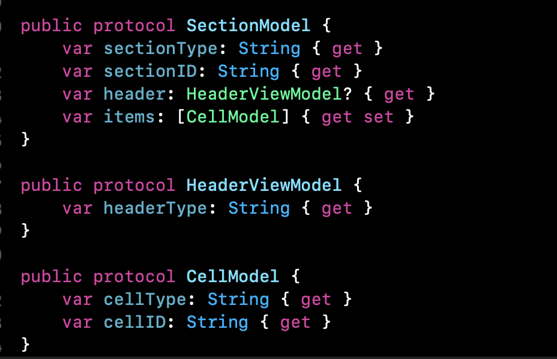
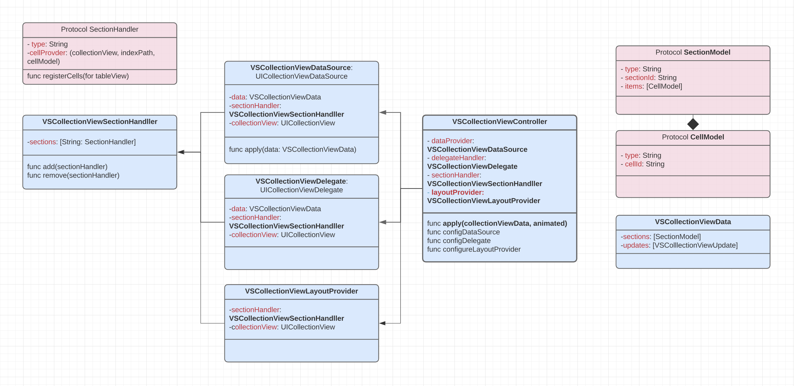

# VSCollectionKit


VSCollectionKit is handy framework supporting funtionality of a UICollectionView or UICollectionViewController with much easier than way we work with UICollectionView, and avoiding a lot of code duplicates. 

VSCollectionKit consist of VSCollectionViewController is subclass of UIViewController with UICollectionView, VSCollectionViewController works in association with 5 other parts like 
- VSCollectionViewDataSource
- VSCollectionViewData
- VSCollectionViewDelegate
- VSCollectionViewLayoutProvider
- VSCollectionViewSectionHandller

As the names of the above components slightly justifys what actaully they are meant for, still will go over one by one

**VSCollectionViewDataSource** is subclass of NSObject confirming to UICollectionViewDataSource, this is class which is mainly involved in handling or supplying data to our collectionView, is takes VSCollectionViewData and applies the new insertions or update changes to current UICollectionView.
this is very import piece in VSCollectionKit, we moslty not be interacting with it, we only talk directly to VSCollectionViewController

**VSCollectionViewData** is struct, it moslty contains the details about our data to be displayed on CollectionView, 
this contains array of sections confirming to SectionModel protocol, and an updates array containing details about the changes in data which is getting applied to a collection via VSCollectionViewDataSource.

The SectionModel, CellModel and HeaderViewModel protocols looks somthing like below


**VSCollectionViewDelegate** is subclass of NSObject confirming to UICollectionViewDelegate, this class  mainly involved in handling delegate events of collectionView, not we are not using this delegate for determining the size of cell or supplementary view


**VSCollectionViewLayoutProvider** as name suggests that is guy is resposible for supplying the layout informations to collectionView, this is using UICollectionViewCompostionalLayout, but still will not be using it direclty rather we would be supplying the layout information for each section via this class

**VSCollectionViewSectionHandller** the last and important component of VSCollectionKit with which we would be moslty interacting with, we would be supplying the cell information, layout information and handling events from the collectionView via VSCollectionViewSectionHandller, will look the below class diagram to find more details on how are they connected.



Thats little knowledge on the VSCollectionKit and its componets, now lets dig a little on how to use it.

**VSCollectionViewSectionHandller** handles the adding and removing of SectionHandler for the VSCollectionViewController, so we can n number of sections supported by collectionview via VSCollectionViewSectionHandller's addSectionHandler(handler: SectionHandler) funtion 

The protocol declaration of SectionHandler is as below.


Looking at the methods we might have few insights where all our collections related funtions falls, yes, its all falls in the indiviual SectionHandler, its very light weight because it contains only the nessary funtions to be implemented, if we still need more we can always go and extent it from components like DataSource and Delegate.

Lets see a quick example on how we can use a VSCollectionKit to display gird of photos from local.

As we know the VSCollectionViewController understands data by VSCollectionData, so our example is quite simple showing list of photos in CollectionView, we would be converting the list of images urls into VSCollectionData's SectionModel and CellModel.

A quick snippet of what i was talking about.


Thinking for how are we provinding the cell and layout information? yea I am coming right there, we need to create a class confirming protocol SectionHandler, which is where we would be implementing the nessary functions to sypply the cell and layout informations to the collection view.


The final touch of how are we applying the data to collectionView shown below.


The below screens shots shows the UI implemented using VSCollectionKit with independant modules for each sections and less of UICollectionView related hazzles for cell size and cell data.


### How to Use

Include the below line in the project cathrage file
```
  git "https://github.com/Vinodh-G/VSCollectionKit.git" >= 0.3
```  
and then call ``` carthage update ``` from the project folder where it is used.


There is News Sample App have developed using the same VSCollectionKit, it supported via Cathrage.
https://github.com/Vinodh-G/NewsApp


  


